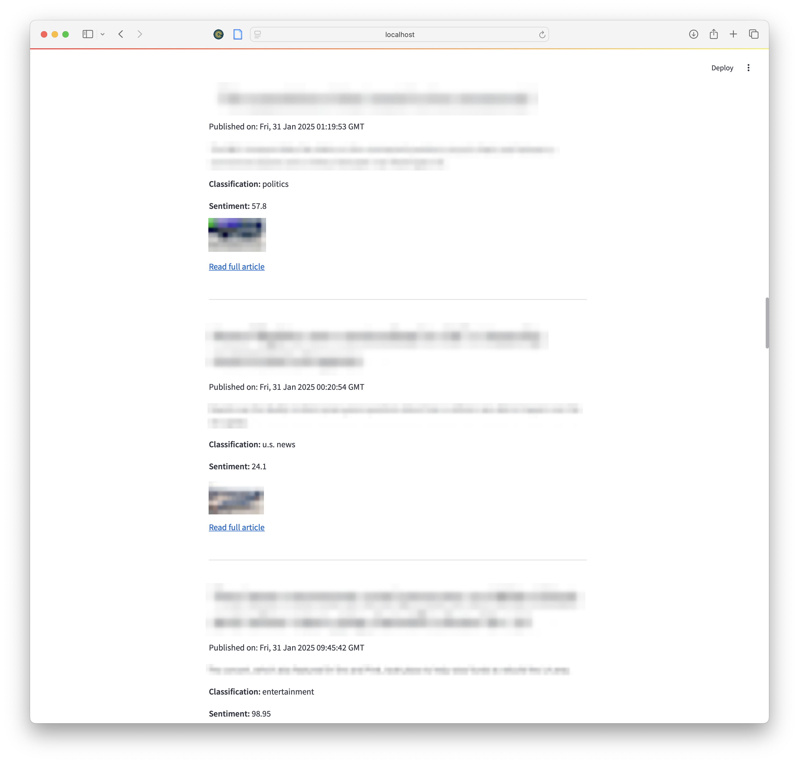

# news-classification

 Streamlit web app that classifies news articles and analyses their sentiment. It uses a BERT-based classifier (cssupport/bert-news-class) for categorising articles, a RoBERTa-based sentiment model (cardiffnlp/twitter-roberta-base-sentiment-latest) for sentiment analysis, and BeautifulSoup for web scraping.

Use Cases:
- Filtering News for Children: Show only age-appropriate content by filtering out harmful or violent news based on classification and sentiment analysis.
- Stock Predictions: Analyse the sentiment of financial news articles and use it to predict stock trends or market movements.
- Political Sentiment Tracking: Monitor and assess public sentiment around political topics, parties, or candidates in real-time based on news coverage.